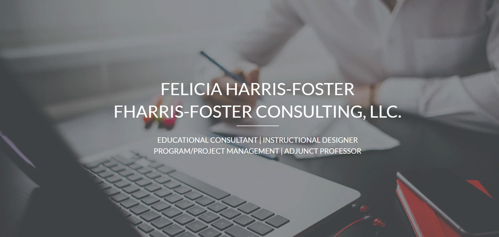
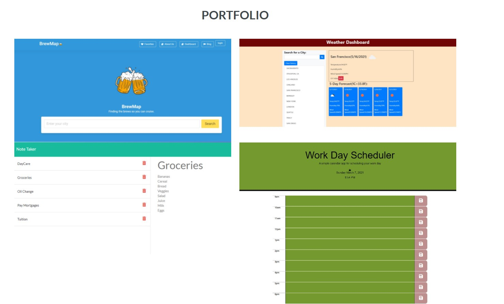

React Personal Portfolio

A personal portfolio page using React.

## Table of Contents
- [Installation](#installation)
- [Usage](#usage)
- [Roadmap](#roadmap)
- [Contributions](#contributions)
- [Questions](#questions)

## Installation
Deployed application: https://felicia-harrisfoster.netlify.app/
 
GitHub deployed link: https://github.com/harrisfd/ReactPorfolio-FDH

## Usage

The following is Felicia Harris-Foster’s deployed React portfolio of work samples.  The portfolio is presented with a page containing a header, section for content, and footer.  Name of Felicia’s name and business is centered in the middle of the page with titles corresponding to the different sections of her portfolio located in the header. Images and links of Felicia’s applications and instructional design work is located in the application. The developed applications are deployed and the GitHub link in the footer will take you to the Felicia’s GitHub repository. The following information that is contained in Felicia’s portfolio includes:
•	About me
•	Portfolio of web development projects
•	Instructional design work
•	Resume
Located at the bottom of the page is the footer with email address for anyone to send an email along with LinkedIn and GitHub links. Felicia does not have a Twitter or Stack Overflow accounts. Message section was not included as the hyperlink to the email address will automatically open for the user to send a message. 

## Roadmap

Continuous updates will help to improve the overall look and feel of the page.  Better graphics and navigation bar, additional work will be added. 

## Contributions

No contributions at this time.

## Questions

Please email fharrisfoster@gmail.com for any questions.

